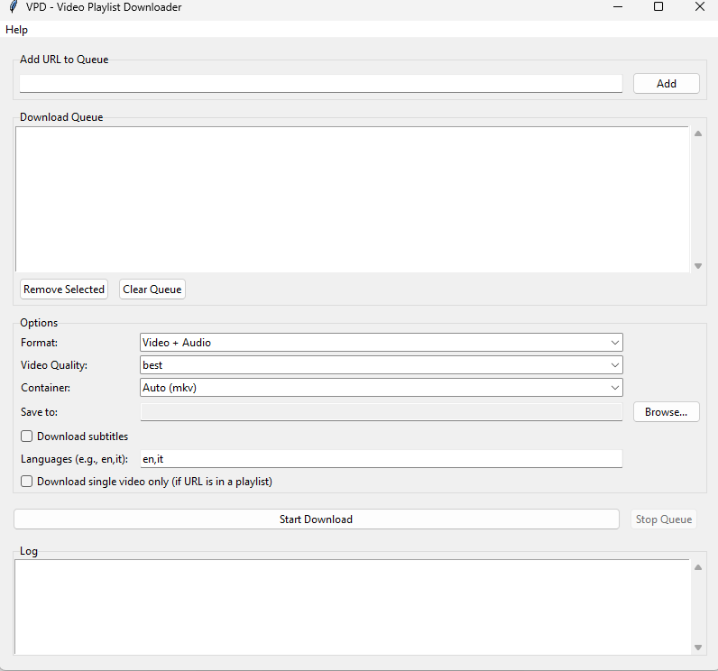

# VPD - Video Playlist Downloader

A simple, user-friendly graphical interface (GUI) for the powerful `yt-dlp` command-line tool. Built to make video and playlist bulk downloading easy for everyone that is sick of shareware freemium BS.

## Features

*   Easy-to-use graphical interface
*   Download single videos or entire playlists
*   Manage a queue of multiple downloads
*   Choose between Video+Audio, Audio Only (mp3/m4a), or Video Only
*   Select video quality and final container format (mkv/mp4)
*   Automatic downloader and setup for the FFmpeg dependency
*   Support for subtitles

## How to Use

1.  Go to the [**Releases**](https://github.com/italianloverboy/VideoPlaylistDownloader/releases) section.
2.  Download the latest `VPD.exe` file.
3.  Run it! No installation needed.

## Credits and License

This application is a GUI for the excellent [**yt-dlp**](https://github.com/yt-dlp/yt-dlp) project. All the heavy lifting is done by their tool.

This GUI is released under the **MIT License**. See the `LICENSE` file for details.

The application uses **FFmpeg** (licensed under the GPL) for processing media files.

**Disclaimer:** This is an unofficial project and is not affiliated with the `yt-dlp` team.

